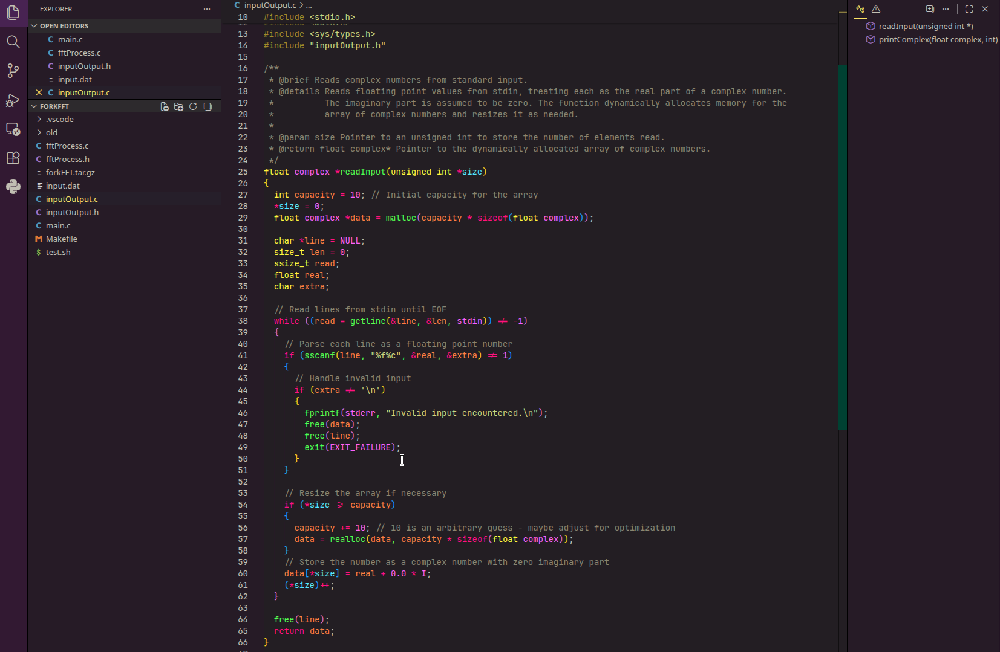

# QCD Theme

A dark vibrant VS Code color theme. High energy!

Best used with semantic highlighting (and a corresponding language server). The theme uses dense information encoding to give each semantic classification a separate color or emphasis—providing comprehensive syntax highlighting for users who want to consume the highest information density.

## Installation

1. Open **Extensions** in VS Code.
2. Search for **QCD Theme**.
3. Click **Install**.

## Activation

1. Open **Preferences: Color Theme**.
2. Select **QCD Theme**.
